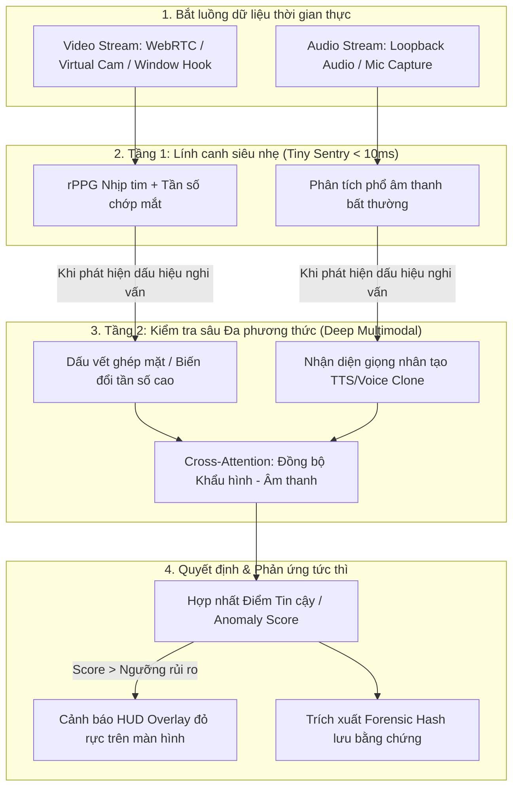

# 🛡️ EdgeDeepfakeGuardian (AI-Sentinel)
### *Hệ Sinh Thái AI Đa Phương Thức Nhận Diện, Ngăn Chặn & Phân Tích Deepfake/DeepVoice Lừa Đảo Theo Thời Gian Thực Tại Biên*

  
  
  
  

  <b>Bảo vệ người dùng trước các cuộc gọi video lừa đảo trực tuyến thế hệ mới (Deepfake Face-Swap, Lip-Sync & Voice Cloning) trực tiếp trên máy tính cá nhân mà không phụ thuộc Cloud, không lo lộ lọt dữ liệu riêng tư và không giật lag.</b>

---

## 📌 1. Bối Cảnh & Vấn Đề Xã Hội (Why This Project Matters?)

Sự phát triển vũ bão của Generative AI (AI tạo sinh) đang biến **Deepfake (giả mạo khuôn mặt)** và **DeepVoice (giả mạo giọng nói)** thành một cuộc khủng hoảng lừa đảo toàn cầu:
* ⚠️ **Kịch bản lừa đảo tinh vi:** Kẻ gian giả danh người thân, đồng nghiệp, công an gọi video call qua Zalo, Messenger, Telegram, Zoom... trong vài giây để yêu cầu chuyển tiền gấp hoặc đánh cắp mã OTP.
* 🛑 **Nút thắt của giải pháp Cloud AI truyền thống:**
  * **Độ trễ cao (>1–2 giây):** Không thể can thiệp tức thời trước khi nạn nhân mắc bẫy.
  * **Xâm phạm quyền riêng tư:** Việc gửi toàn bộ luồng video/âm thanh cá nhân lên máy chủ đám mây vi phạm nghiêm trọng an toàn dữ liệu (GDPR, Nghị định 13/2023/NĐ-CP).
  * **Chi phí khổng lồ:** Đòi hỏi cụm GPU đắt đỏ để suy luận liên tục.

👉 **Giải pháp của chúng tôi:** Chuyển dịch toàn bộ sức mạnh phân tích AI xuống **thiết bị biên (Edge Device / Local PC)** — Xử lý tức thì, bảo mật tuyệt đối, tiết kiệm tài nguyên.

---

## ✨ 2. Các Tính Năng Nổi Bật (Key Features)

* 🔴 **Phân tích Đa phương thức Thời gian thực (Real-time Multimodal Analysis):** Kết hợp đồng thời 3 luồng dữ liệu: **Khuôn mặt (Vision) + Giọng nói (Audio) + Độ lệch pha khẩu hình (Lip-Sync)**.
* ⚡ **Công nghệ Siêu nhẹ tại Biên (Zero-OOM Edge AI):** Tối ưu hóa bằng lượng tử hóa **INT8 / ONNX Runtime / DirectML**, chạy mượt mà trên laptop phổ thông ($\ge 30\text{ FPS}$, độ trễ $< 40\text{ms}$, RAM $< 350\text{MB}$).
* 🩺 **Trích xuất Tín hiệu Nhịp tim Sinh học (rPPG Liveness):** Đọc biến thiên màu da mao mạch vi mô để nhận diện người thật; video Deepfake tái tạo khuôn mặt bằng AI luôn triệt tiêu hoặc làm méo tín hiệu nhịp tim này.
* 👄 **Bắt Lệch Pha Âm Vị & Khẩu Hình (Phoneme-Viseme Discrepancy):** Phát hiện độ trễ phi tự nhiên giữa âm thanh phát ra và cử động của môi.
* 🛡️ **Lớp Phủ Cảnh Báo Thông Minh (Smart HUD Overlay):** Hiển thị thanh đo rủi ro Deepfake (Threat Meter) trực quan đè lên ứng dụng gọi video mà không làm gián đoạn cuộc gọi.
* 🔒 **Bảo Mật Tuyệt Đối (Privacy-by-Design):** Không lưu trữ hình ảnh/âm thanh gốc; chỉ mã hóa các vector dấu vết giả mạo (*Zero-Knowledge Forensic Hash*).

---

## 🏗️ 3. Hệ Thống Hoạt Động Như Thế Nào? (How It Works)

Hệ thống hoạt động theo cơ chế **Phân tầng Kích hoạt (Cascaded Sentry Architecture)** nhằm tối ưu hóa 100% tài nguyên máy tính:

---

## 🔬 4. Trụ Cột Công Nghệ Lõi (Core Technologies)

| Trụ cột | Kỹ thuật áp dụng | Mục tiêu giải quyết |
| :--- | :--- | :--- |
| **Thị giác (Vision)** | rPPG (CHROM/POS), 2D-FFT Artifacts, Eye-blink dynamics | Phát hiện thay đổi kết cấu da, viền ghép mặt và bất đối xứng phản xạ ánh sáng |
| **Thính giác (Audio)** | AASIST, RawNet3, Wav2Vec 2.0 / HuBERT features | Bắt dấu vết lượng tử hóa và méo pha của các mô hình Voice Clone (RVC, VITS) |
| **Đa phương thức (Multimodal)** | Audio-Visual Lip-Sync Cross-Attention (SyncNet/AV-HuBERT) | Phát hiện sự bất nhất giữa khẩu hình miệng và giọng nói phát ra |
| **Tối ưu Biên (Edge AI)** | Model Distillation, INT8 Quantization, ONNX Runtime, DirectML | Giữ FPS $\ge 30$, Latency $\le 35\text{ms}$, tránh tràn bộ nhớ (Zero-OOM) |

---

## 💻 5. Tech Stack

* **Ngôn ngữ:** Python 3.10+, C++ (Core acceleration)
* **Framework AI:** PyTorch, TorchAudio, TorchVision, HuggingFace Transformers
* **Thị giác & Âm thanh:** OpenCV, MediaPipe, Librosa, SoundFile
* **Edge Inference Engine:** ONNX Runtime, DirectML, OpenVINO, TensorRT
* **Giao diện & Ứng dụng Desktop:** PyQt6 / CustomTkinter, Windows Loopback Audio API

---

## 🎯 6. Chỉ Tiêu Đánh Giá Kỹ Thuật (Target Benchmarks)

Hệ thống được thiết kế hướng đến chuẩn mực đồ án tốt nghiệp xuất sắc và bài báo khoa học:

| Chỉ số | Mục tiêu kỹ thuật | Bộ dữ liệu thử nghiệm |
| :--- | :---: | :--- |
| **Video Deepfake AUC** | $\ge \mathbf{96.5\%}$ | *Celeb-DF v2, FaceForensics++* |
| **Voice Spoofing EER** | $\le \mathbf{2.8\%}$ | *ASVspoof 2021, In-the-wild Voice* |
| **Tốc độ khung hình (FPS)** | $\ge \mathbf{30 \text{ FPS}}$ | Video thời gian thực (1080p/720p) |
| **Độ trễ suy luận (Latency)** | $\le \mathbf{35 \text{ ms}}$ | CPU Intel Core i5 / AMD Ryzen 5 |
| **Bộ nhớ chiếm dụng** | $<\mathbf{350 \text{ MB RAM}}$ | Không gây treo đơ máy tính |

---

## 🗺️ 7. Lộ Trình Phát Triển 24 Tháng (2026 – 2028)

* [x] **Giai đoạn 1 (Kỳ 1 Năm 3):** Xây dựng nền tảng Toán, PyTorch nâng cao, DSP Audio & Data Preprocessing Pipeline.
* [ ] **Giai đoạn 2 (Kỳ 2 Năm 3):** Nghiên cứu chuyên sâu mô hình rPPG, Audio Anti-Spoofing & Lip-Sync Cross-Attention.
* [ ] **Giai đoạn 3 (Kỳ 1 Năm 4):** Tối ưu hóa lượng tử hóa INT8, triển khai ONNX Edge Runtime & Công bố bài báo khoa học.
* [ ] **Giai đoạn 4 (Kỳ 2 Năm 4):** Đóng gói Desktop App, hoàn thiện Luận văn Tốt nghiệp và chuẩn bị Live Demo bảo vệ điểm 10.

*(Xem chi tiết từng bước học tập và thực hành tại [ROADMAP_GRADUATION_THESIS_EDGE_DEEPFAKE.md](./ROADMAP_GRADUATION_THESIS_EDGE_DEEPFAKE.md))*

---

## 👥 8. Tác Giả & Liên Hệ

* **Sinh viên thực hiện:** [Tên Của Bạn]
* **Chuyên ngành:** Trí Tuệ Nhân Tạo (Artificial Intelligence)
* **GitHub:** [@Stuckwthuw](https://github.com/Stuckwthuw)
* **Repository:** [DeepFake-VoiceFake-AI-](https://github.com/Stuckwthuw/DeepFake-VoiceFake-AI-)

---

  <i>⭐ Nếu bạn thấy dự án này thú vị và có ích cho cộng đồng, hãy nhấn <b>Star</b> để ủng hộ tác giả nhé! ⭐</i>

