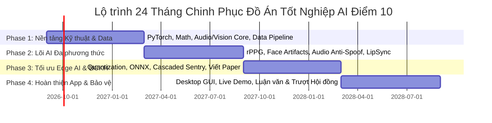

# 🛡️ MASTER ROADMAP: REAL-TIME MULTIMODAL EDGE DEEPFAKE DETECTION
> **Đồ Án Tốt Nghiệp Ngành Trí Tuệ Nhân Tạo (AI)**  
> **Tác giả:** [Tên Của Bạn]  
> **Thời gian thực hiện:** 1.5 – 2 Năm (Từ Đầu Năm 3 đến Cuối Năm 4)  
> **Mục tiêu đầu ra:** Đạt điểm 10/10 ĐATN, Công bố 01 Bài báo Khoa học (Scopus/IEEE/Hội nghị), Hoàn thiện 01 Ứng dụng Desktop Edge AI có Live Demo ấn tượng.

---

## 📊 TỔNG QUAN LỘ TRÌNH 4 GIAI ĐOẠN (24 THÁNG)

---

## 🎯 GIAI ĐOẠN 1: NỀN TẢNG KỸ THUẬT & TIỀN XỬ LÝ ĐA TÍN HIỆU (Tháng 1 – 6 | Kỳ 1 Năm 3)
* **Mục tiêu:** Nắm vững bản chất toán học của Deep Learning, làm chủ PyTorch ở mức Custom Architecture, và thành thạo xử lý tín hiệu Hình ảnh & Âm thanh.

### 📚 1.1. Kiến thức & Kỹ năng Cần Học
- [ ] **Toán học cho AI:**
  - [ ] Đại số tuyến tính: Vector spaces, SVD, Eigenvalues, Matrix operations.
  - [ ] Xác suất thống kê: Bayes theorem, Maximum Likelihood Estimation (MLE), KL-Divergence.
  - [ ] Giải tích đa biến & Tối ưu: Gradient Descent, AdamW, Backpropagation từ bản chất toán.
- [ ] **PyTorch Nâng cao (Không dùng code mẫu mì ăn liền):**
  - [ ] Xây dựng `Dataset`, `DataLoader` đa luồng, xử lý dữ liệu video/audio song song.
  - [ ] Tự viết Custom Loss Functions (Contrastive Loss, ArcFace, Triplet Loss, Focal Loss).
  - [ ] Quản lý thí nghiệm và tracking metric với `TensorBoard` hoặc `Weights & Biases (WandB)`.
- [ ] **Xử lý Thị giác Máy tính (Computer Vision):**
  - [ ] OpenCV nâng cao: Color spaces ($RGB, YCbCr, HSV, L^*a^*b^*$), Affine Transformation, Spatial Filtering.
  - [ ] Face Detection & Alignment: Trích xuất 68/468 điểm mốc khuôn mặt (Face Landmarks) với `MediaPipe` và `RetinaFace`.
  - [ ] Kiến trúc mạng: CNNs hiện đại (EfficientNet, ConvNeXt) và Vision Transformers (ViT, Swin Transformer).
- [ ] **Xử lý Tín hiệu Âm thanh (Audio & DSP):**
  - [ ] Biến đổi Fourier liên tục & rời rạc (STFT - Short-Time Fourier Transform).
  - [ ] Biểu diễn phổ âm: Mel-Spectrogram, MFCC (Mel-Frequency Cepstral Coefficients), CQCC.
  - [ ] Thư viện: `torchaudio`, `librosa`, `soundfile`.

### 🛠️ 1.2. Nhiệm vụ Thực hành & Tích lũy vào Đồ án
- [ ] **Mini-Project 1.1:** Xây dựng module tự động cắt khuôn mặt (Face Cropping & Alignment) từ video 30 FPS với độ trễ < 5ms.
- [ ] **Mini-Project 1.2:** Xây dựng module phân tích Spectrogram âm thanh thời gian thực từ Microphone.
- [ ] **Chuẩn bị Dữ liệu (Dataset Pipeline):** Tải và viết script xử lý trước (pre-processing) các bộ dữ liệu Deepfake chuẩn:
  - [ ] *FaceForensics++ (FF++)*
  - [ ] *Celeb-DF v2*
  - [ ] *FakeAVCeleb* (Bộ dataset đa phương thức gồm cả Audio & Video)
  - [ ] *ASVspoof 2021* (Dataset chuyên về nhận diện giọng giả mạo)

---

## 🧠 GIAI ĐOẠN 2: NGHIÊN CỨU & XÂY DỰNG LÕI AI ĐA PHƯƠNG THỨC (Tháng 7 – 12 | Kỳ 2 Năm 3)
* **Mục tiêu:** Xây dựng thành công các mô hình SOTA nhận diện Deepfake Đơn phương thức và Hợp nhất Đa phương thức (Multimodal Fusion).

### 📚 2.1. Kiến thức & Kỹ thuật Chuyên sâu Cần Học
- [ ] **Phân tích Tín hiệu Sinh học rPPG (Remote Photoplethysmography):**
  - [ ] Bản chất: Phát hiện sự thay đổi màu sắc vi mô của mao mạch dưới da theo chu kỳ tim.
  - [ ] Thuật toán trích xuất: CHROM, POS, Green-channel FFT, PhysNet (3D-CNN trích xuất rPPG).
  - [ ] Ý nghĩa: Video deepfake tạo bởi AI thường làm méo hoặc triệt tiêu tín hiệu xung nhịp tim tự nhiên.
- [ ] **Phát hiện Dấu vết Thao túng Khuôn mặt (Visual Artifacts):**
  - [ ] Face Warping Artifacts: Phát hiện viền ghép mặt, sai lệch tần số cao bằng biến đổi Wavelet / FFT 2D.
  - [ ] Inconsistent Lighting & Corneal Reflection: Đánh giá bất đối xứng phản xạ ánh sáng trong giác mạc mắt.
  - [ ] Blinking & Eye Movement: Nhận diện bất thường chu kỳ chớp mắt bằng LSTM/GRU/Transformer.
- [ ] **Phát hiện Giọng nói Giả mạo (Audio Anti-Spoofing):**
  - [ ] Kiến trúc chuyên dụng: AASIST (Graph Neural Network cho Audio), RawNet3, LCNN.
  - [ ] Self-Supervised Learning (SSL) Embeddings: Trích xuất đặc trưng từ `Wav2Vec 2.0` hoặc `HuBERT`.
- [ ] **Hợp nhất Đa phương thức & Đồng bộ Khẩu hình (Audio-Visual Lip-Sync):**
  - [ ] Đối chiếu Phoneme (Âm vị phát ra) và Viseme (Khẩu hình môi).
  - [ ] Kiến trúc SyncNet / AV-HuBERT / Cross-Attention Transformer để đo độ lệch pha (Audio-Visual Asynchrony).

### 🛠️ 2.2. Nhiệm vụ Thực hành & Tích lũy vào Đồ án
- [ ] Huấn luyện thành công mô hình **Visual Deepfake Detector** đạt $AUC \ge 95\%$ trên tập *Celeb-DF*.
- [ ] Huấn luyện thành công mô hình **Voice Anti-Spoofing Detector** đạt $EER \le 3\%$ trên tập *ASVspoof*.
- [ ] Huấn luyện thành công module **Audio-Visual Cross-Attention Fusion** kết hợp cả 2 luồng.
- [ ] Thu thập thêm tập dữ liệu "In-the-wild" từ các công nghệ mới nhất: *HeyGen, D-ID, Deep-Live-Cam, RVC (Retrieval-based Voice Conversion)* để kiểm tra tính tổng quát hóa (Generalization).

---

## ⚡ GIAI ĐOẠN 3: TỐI ƯU HÓA BIÊN (EDGE AI) & NGHIÊN CỨU KHOA HỌC (Tháng 13 – 18 | Kỳ 1 Năm 4)
* **Mục tiêu:** Nén và tăng tốc mô hình để chạy thời gian thực trên phần cứng phổ thông (Laptop/PC bình thường không cần GPU rời đắt tiền). Viết bài báo khoa học.

### 📚 3.1. Kiến thức & Kỹ thuật Tối ưu Biên Cần Học
- [ ] **Kỹ thuật Nén Mô Hình (Model Compression):**
  - [ ] **Knowledge Distillation (Chưng cất tri thức):** Dạy mô hình nhỏ (Student) học từ mô hình khổng lồ (Teacher).
  - [ ] **Structured Pruning:** Cắt tỉa các kênh (channels) không quan trọng để giảm FLOPs.
  - [ ] **Quantization (Lượng tử hóa):**
    - [ ] Post-Training Quantization (PTQ): Chuyển đổi FP32 $\rightarrow$ FP16 / INT8.
    - [ ] Quantization-Aware Training (QAT): Huấn luyện thích ứng lượng tử hóa để giữ nguyên độ chính xác ($< 1\%$ sai lệch).
- [ ] **Triển khai với Runtime Engine Tốc độ cao:**
  - [ ] Export PyTorch $\rightarrow$ **ONNX (Open Neural Network Exchange)**.
  - [ ] Thực thi ONNX Runtime với các Execution Providers: `DirectML` (hỗ trợ mọi GPU AMD/Intel/Nvidia trên Windows), `OpenVINO` (Intel CPU/iGPU), `TensorRT` (Nvidia GPU).
- [ ] **Kiến trúc Phân tầng Kích hoạt (Cascaded Sentry Architecture):**
  - [ ] *Tầng 1 (Tiny Sentry):* Model siêu nhẹ (~5MB) chạy liên tục quét nhanh ($5-10ms$).
  - [ ] *Tầng 2 (Deep Inspector):* Chỉ kích hoạt mô hình nặng khi Tầng 1 báo độ bất thường vượt ngưỡng.

### 🛠️ 3.2. Nhiệm vụ Thực hành & Tích lũy vào Đồ án
- [ ] Đạt chỉ số hiệu năng trên máy tính Core i5 / Ryzen 5 (GPU Onboard hoặc GTX 1650):
  - [ ] **Tốc độ xử lý:** $\ge 30 \text{ FPS}$ liên tục.
  - [ ] **Độ trễ suy luận (Latency):** $\le 35 \text{ ms}$ cho mỗi khung hình.
  - [ ] **Bộ nhớ RAM tiêu thụ:** $\le 350 \text{ MB}$, hoàn toàn không bị tràn bộ nhớ (Zero-OOM).
- [ ] **Nghiên cứu khoa học (Đạt điểm cộng tuyệt đối):**
  - [ ] Viết bản thảo bài báo khoa học (Research Paper) bằng tiếng Anh cùng Giảng viên hướng dẫn.
  - [ ] Gửi bài tham gia hội nghị trong nước/quốc tế (VD: IEEE RIVF, KSE, MAPR, FAIR, hoặc Euréka).

---

## 💻 GIAI ĐOẠN 4: ĐÓNG GÓI SẢN PHẨM, LUẬN VĂN & BẢO VỆ ĐATN (Tháng 19 – 24 | Kỳ 2 Năm 4)
* **Mục tiêu:** Hoàn thiện sản phẩm phần mềm chuyên nghiệp, hoàn thành quyển đồ án chuẩn mực và chuẩn bị màn Live Demo thuyết phục Hội đồng.

### 📚 4.1. Kiến thức Kỹ thuật Phần mềm (Software Engineering)
- [ ] Xây dựng Desktop Application (Python với `PyQt6` / `CustomTkinter` hoặc `Electron + C++ Backend`).
- [ ] Kỹ thuật Capture luồng Video/Audio:
  - [ ] Hook âm thanh hệ thống (WASAPI loopback trên Windows).
  - [ ] Hook luồng Camera ảo / Cửa sổ ứng dụng (Zoom, Google Meet, Zalo, Telegram).
- [ ] Thiết kế giao diện cảnh báo (HUD Overlay): Thanh đo rủi ro Deepfake (Threat Meter), đồ thị nhịp tim rPPG trực quan.

### 🛠️ 4.2. Nhiệm vụ Hoàn tất Đồ án Tốt nghiệp
- [ ] **Hoàn thiện Quyển Luận Văn (Thesis Document):**
  - [ ] *Chương 1:* Tổng quan bài toán lừa đảo Deepfake và thách thức suy luận tại Biên.
  - [ ] *Chương 2:* Cơ sở lý thuyết (rPPG, Acoustic Artifacts, Lip-sync, Model Compression).
  - [ ] *Chương 3:* Đề xuất Kiến trúc Hệ thống & Thuật toán Đa phương thức Phân tầng.
  - [ ] *Chương 4:* Thực nghiệm, Đánh giá kết quả (Ablation Study, So sánh Benchmark với SOTA).
  - [ ] *Chương 5:* Thiết kế Ứng dụng Biên, Kết luận & Hướng phát triển.
- [ ] **Kịch bản "Live Demo" tại buổi bảo vệ:**
  - [ ] Chuẩn bị 2 máy: 1 máy đóng vai kẻ lừa đảo phát Deepfake (Face-swap + Voice Clone), 1 máy cài phần mềm của bạn.
  - [ ] Thực hiện cuộc gọi video trực tiếp: Phần mềm bắt ngay lập tức trong vòng 1-2 giây, cảnh báo đỏ màn hình và phân tích chi tiết lỗi giả mạo.
- [ ] **Thiết kế Slide Báo cáo Chuyên nghiệp:** Tinh gọn, nhiều sơ đồ kiến trúc, biểu đồ số liệu rõ ràng, hạn chế tối đa chữ.

---

## 📈 TIÊU CHÍ NGHIỆM THU ĐẠT ĐIỂM 10 CỦA ĐỒ ÁN

| Hạng mục | Chỉ tiêu kỹ thuật cam kết | Mức độ hoàn thành |
| :--- | :--- | :---: |
| **Độ chính xác Video (AUC)** | $\ge 96.5\%$ trên Celeb-DF v2 | [ ] |
| **Độ chính xác Audio (EER)** | $\le 2.8\%$ trên ASVspoof 2021 | [ ] |
| **Tốc độ xử lý (FPS)** | $\ge 30 \text{ FPS}$ (Real-time video) | [ ] |
| **Độ trễ toàn hệ thống (Latency)** | $\le 40 \text{ ms}$ | [ ] |
| **Chiếm dụng tài nguyên** | RAM $< 400\text{MB}$, CPU $< 15\%$, VRAM $< 500\text{MB}$ | [ ] |
| **Khả năng chạy tại Biên** | Chạy mượt mà trên laptop phổ thông (Không cần Cloud) | [ ] |
| **Bài báo khoa học / Giải thưởng** | Đã submit / chấp nhận 01 Paper hoặc Giải NCKH | [ ] |
| **Mức độ hoàn thiện App** | Đóng gói file `.exe` cài đặt 1-click, có Live Demo trực tiếp | [ ] |

---

> 💡 **Lời khuyên từ Giảng viên:**  
> *"Đừng bao giờ đợi học xong hết lý thuyết mới code. Hãy code song song: Đọc 1 paper $\rightarrow$ Tái hiện lại 1 module nhỏ $\rightarrow$ Đo đạc và ghi chép nhật ký nghiên cứu vào GitHub này mỗi tuần!"*
